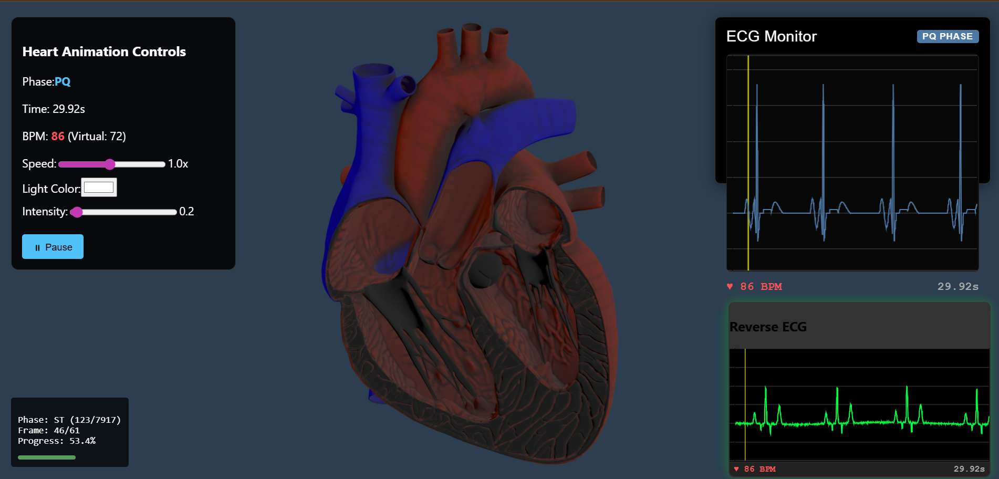

# ❤️ Heart App – Real-Time ECG Simulation & Visualization

This project visualizes real-time ECG signals, simulates heart activity using PQRST waveforms, and integrates with a Unity-based logic for accurate waveform rendering. It also includes a Google Colab notebook for ECG signal processing and dataset analysis.

---

## 📁 Project Structure

heart/
├── public/
│ └── pqrst_intervals.json   # Phase intervals used by ECG graph
├── src/
│ ├── ECGVisualization.js    # Forward ECG (drives heart model)
│ ├── ReverseECG.js     # Reverse ECG (feedback from heart)
│ ├── App.js
│ └── ...
├── datasets/
│ └── mit-bih-arrhythmia-database-1.0.0   # ECG/heart related datasets
├── notebooks/
│ └── ecg-analysis.ipynb      # Colab notebook for ECG analysis
├── .gitignore
├── package.json
├── README.md


---

## ⚙️ Features

- 📈 Real-time **ECG waveform visualization** (forward and reverse)
- 🎯 Physics-based logic inspired by Unity simulation
- 🧠 Web Worker offloads synthetic ECG generation
- 🔄 Live **QRS**, **P**, and **T wave** rendering
- 🔁 Bidirectional communication with heart model
- 📚 Dataset & Google Colab integration for signal analysis

---

## 🚀 Getting Started

### 1. Clone the repo

```bash
git clone https://github.com/Kalmeshteli17/heart.git
cd heart

2. Install dependencies
npm install

3. Run the app locally
npm start
App will be available at http://localhost:3000


📊 Dataset
All datasets used for PQRS waveform generation and visualization are located in:
/datasets/
Feel free to add ECG recordings, MIT-BIH samples, or synthetic signal datasets here.

 Notebooks

You’ll find Google Colab-compatible notebooks under:
/notebooks/ecg-analysis.ipynb
This includes:

Signal cleaning & smoothing

Peak detection

PQRS interval annotation

BPM estimation


Git Ignore Highlights
Your .gitignore prevents the following from being tracked:
node_modules/
build/
.env*
*.log
Your datasets, notebooks, and source files will be safely committed to GitHub.

📸 Preview



👨‍💻 Credits
ECG waveform logic based on Unity's LineRenderer

Visualization using Chart.js

Designed & built by Kalmesh Bharamappa Teli and Kiran

🧠 License
MIT License. Feel free to use and modify.

